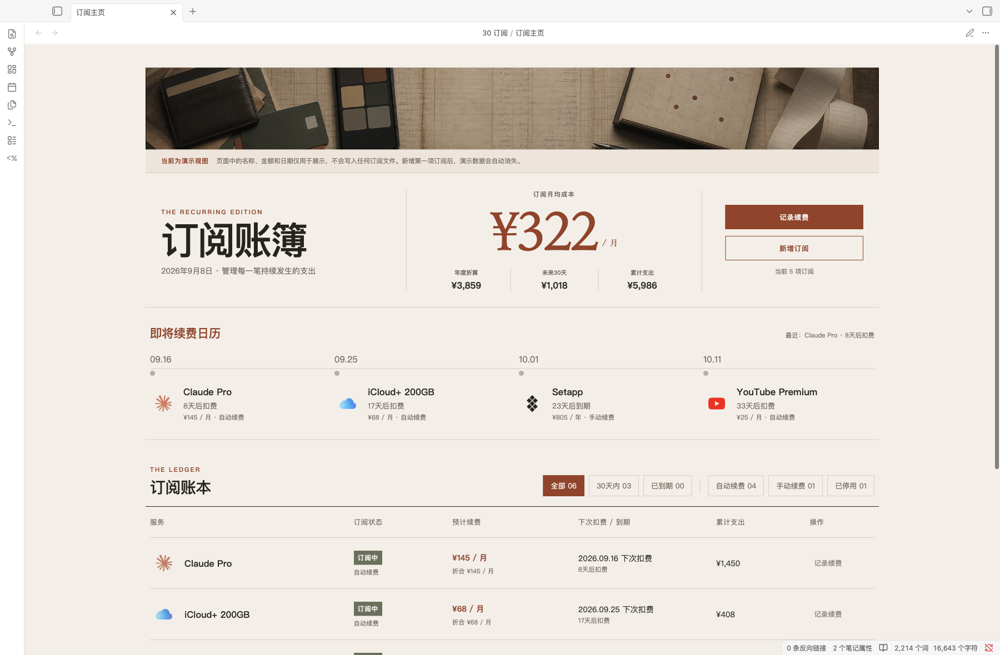
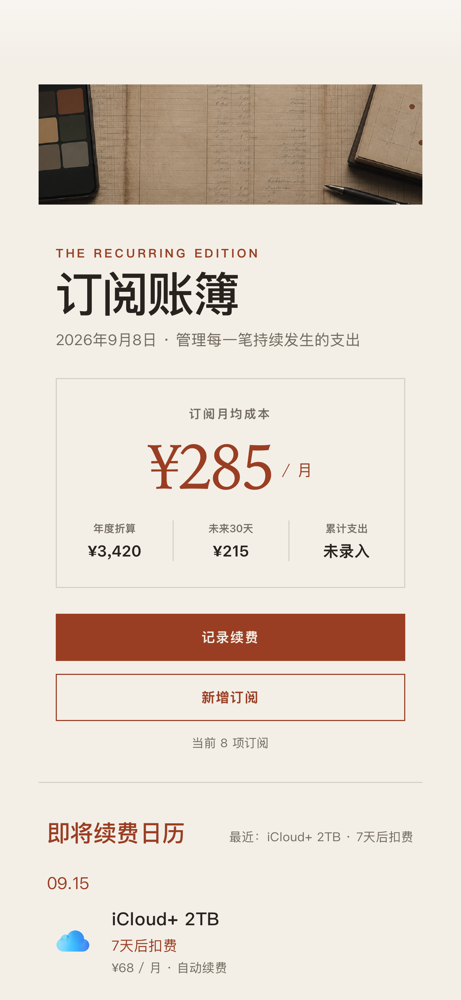
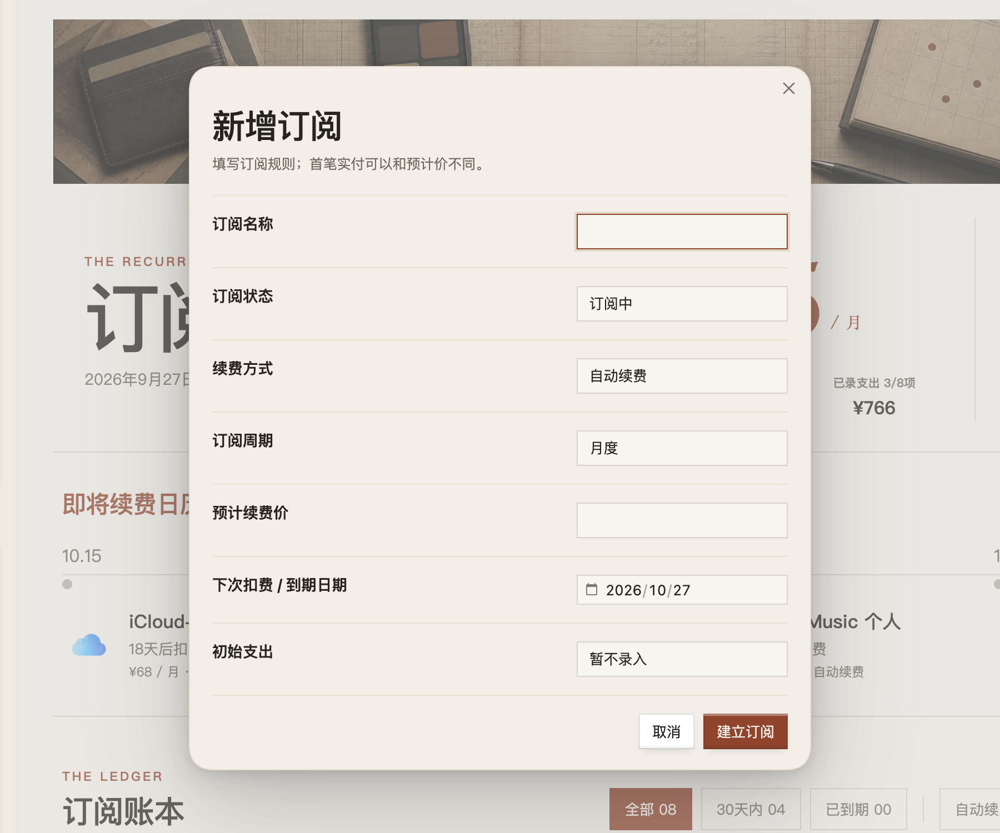
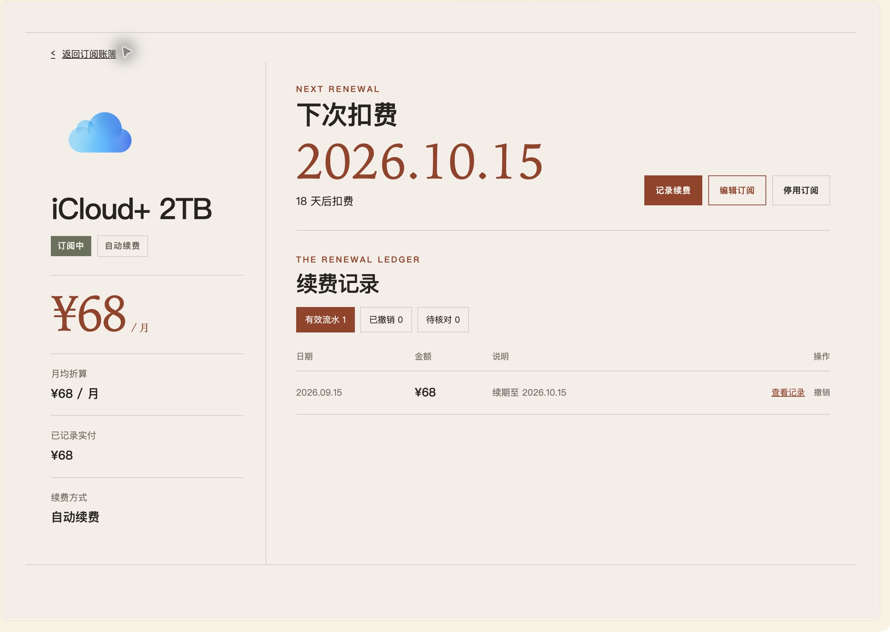
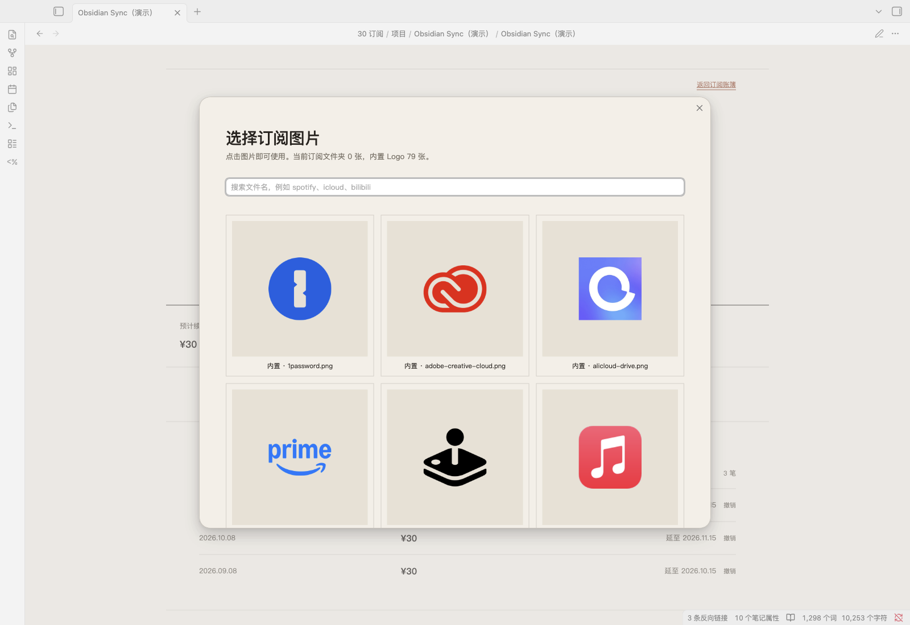

# Obsidian 订阅账簿

一套运行在 Obsidian 里的本地订阅管理模板，用来查看月均成本、年度折算、近期续费、订阅明细和每一笔续费记录。

它不会连接银行卡、支付宝或任何订阅平台。所有记录都是普通 Markdown 文件，保存在你自己的 Obsidian 仓库中。

> 截图中的名称、金额和日期均为演示数据，不对应任何人的真实消费。



<p align="center">
  
</p>

## 能做什么

- 汇总正在使用的订阅，计算月均成本和年度折算。
- 查看未来 30 天需要扣费或到期的项目。
- 按“30 天内、已到期、自动续费、手动续费、已停用”筛选。
- 新增、编辑、停用和重新启用订阅。
- 记录每次实际支付，并自动顺延下一次扣费或到期日期。
- 在订阅档案里追溯历史续费；误记时可撤销，记录会移入归档而不是永久删除。
- 内置 79 张常见订阅 Logo，也允许使用自己的图片。
- 同时适配桌面与窄屏布局。

| 新增订阅 | 订阅档案与续费记录 |
| --- | --- |
|  |  |



## 运行要求

以下是本模板当前实测可用的组合，不代表理论最低版本：

| 软件 / 插件 | 实测版本 | 用途 |
| --- | ---: | --- |
| Obsidian | 1.13.x | 运行模板 |
| [Dataview](https://github.com/blacksmithgu/obsidian-dataview) | 0.5.68 | 汇总与渲染订阅数据 |
| [Templater](https://github.com/SilentVoid13/Templater) | 2.25.0 | 新增、编辑和记录续费 |
| [Meta Bind](https://github.com/mProjectsCode/obsidian-meta-bind-plugin) | 1.5.1 | 页面按钮与 Templater 操作 |

这三个社区插件必须安装。截图使用 Obsidian 默认浅色主题；其他主题通常也能运行，但视觉细节可能不同。

## 快速开始

1. 下载仓库并解压，或者克隆到本地。
2. 在 Obsidian 中选择“将文件夹作为仓库打开”。
3. 进入“设置 → 第三方插件”，关闭安全模式，并分别安装、启用 Dataview、Templater 和 Meta Bind。
4. 在 Dataview 设置中启用 **Enable JavaScript Queries**。
5. 在 Templater 设置中把 **Template folder location** 设为 `90 模板`。
6. 进入“设置 → 外观 → CSS 代码片段”，启用 `subscription-editorial`。
7. 打开 `30 订阅/订阅主页.md`，切换到阅读视图。

首次打开时会显示一组只存在于页面内存中的演示数据，方便确认界面是否正常。新增第一项真实订阅后，演示数据会自动消失。

如果要并入已有仓库，请不要直接覆盖自己的整个 `.obsidian` 文件夹。完整的合并步骤见 [使用说明](使用说明.md)。

## 目录结构

```text
.
├── 30 订阅/
│   ├── 订阅主页.md
│   ├── 项目/                 # 运行后生成；默认不提交到 Git
│   └── _续费记录/            # 运行后生成；默认不提交到 Git
├── 90 模板/
│   ├── 订阅自动化/           # Templater 脚本与订阅档案母版
│   └── 订阅素材/
│       ├── 订阅 Logo/        # 79 张内置透明 PNG
│       └── 订阅总览横幅.png
├── .obsidian/
│   ├── snippets/subscription-editorial.css
│   └── ...                   # 最小配置示例，不含插件程序
├── docs/images/              # README 演示截图
├── scripts/validate-package.cjs
├── 使用说明.md
├── LICENSE
└── THIRD_PARTY_NOTICES.md
```

## 数据与隐私

- 仓库中不包含作者的订阅项目、续费记录、账号、设备路径或 Obsidian 工作区状态。
- 新增的订阅写入 `30 订阅/项目/`，续费流水写入 `30 订阅/_续费记录/`。
- `.gitignore` 默认排除这两个数据目录中的内容，避免使用者误把自己的账目推送到公开仓库。
- 模板没有联网、支付同步、遥测或自动上传功能。是否同步到 iCloud、Git、Obsidian Sync 等服务，由使用者自己的仓库设置决定。
- DataviewJS 与 Templater 都可以执行代码。请只从可信来源下载模板，并在更新前阅读差异。

发布维护者可以运行下面的命令，检查必要文件、脚本语法、Logo 规格、README 本地链接、插件程序和常见个人路径：

```bash
node scripts/validate-package.cjs
```

## 内置 Logo 与许可

代码、模板文本与 CSS 使用 MIT License。第三方插件程序没有打包进本仓库，需要由 Obsidian 的社区插件市场单独安装。

内置品牌名称和 Logo 仅用于帮助使用者识别、记录自己的订阅，相关权利归各自权利人所有；这些品牌素材不属于本项目的 MIT 授权范围。本项目与相关品牌不存在隶属、赞助或合作关系。详细来源见 [Logo 素材索引](90%20模板/订阅素材/订阅%20Logo/README.md) 和 [第三方说明](THIRD_PARTY_NOTICES.md)。

## 使用文档

安装、软件设置、日常操作、目录改名和故障排查都整理在 [使用说明.md](使用说明.md)。

## License

MIT。品牌标识及其他第三方素材除外，见 [THIRD_PARTY_NOTICES.md](THIRD_PARTY_NOTICES.md)。
